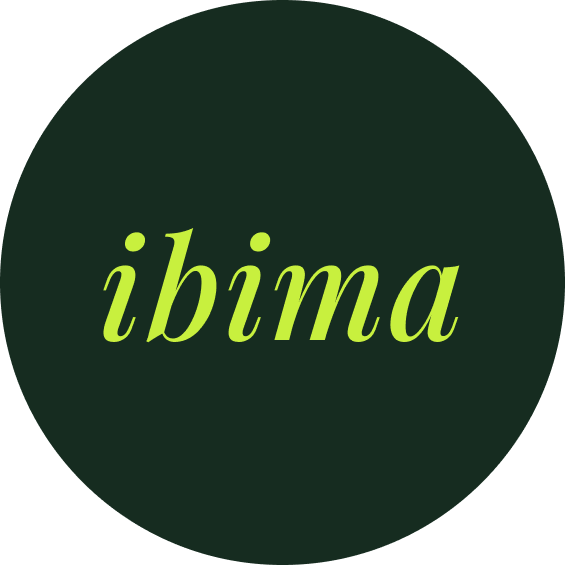

<div align="center">
  
  <h1>Ibima. To build.</h1>
  <p><strong>Premium Offshore Talent — Embedded Directly Into Your Team.</strong></p>
  <p>
    <a href="https://reactjs.org/">
      
    </a>
    <a href="https://vitejs.dev/">
      
    </a>
    <a href="https://tailwindcss.com/">
      
    </a>
    <a href="https://motion.dev/">
      
    </a>
    <a href="https://www.figma.com/design/NDV1dbH6FnLcJEG4IXzWDx/Ibima?node-id=0-1&t=STAKo5mE98FrFr1A-1">
      
    </a>
  </p>
</div>

<br />

## 🌟 About Ibima

**Ibima** isn't another traditional agency or middleman. We connect founders directly with world-class offshore talent. From discovery to onboarding in as little as 72 hours, we provide an evolved process built around speed and uncompromising quality.

> *Over 500 founders have trusted Ibima to build their remote teams — from seed to scale.*

---

## 🚀 Key Features

- **Dynamic UI/UX:** Built with React 18 and powered by seamless Framer Motion animations.
- **Modern Architecture:** Scaffolding done via Vite for ultra-fast HMR and optimized production builds.
- **Fully Responsive:** Tailwind CSS standardizes styling perfectly down to mobile screens.
- **Enterprise-ready Components:** Powered by Radix UI primitives for true accessibility.
- **Deploy-Ready:** Fully pre-configured for frictionless zero-config deployment on Vercel.

---

## 🛠️ Quick Start

Want to spin up Ibima locally? You're just two commands away.

### Prerequisites

Make sure you have [Node.js](https://nodejs.org/) installed along with `npm` (or `pnpm`).

### Installation & Serving

1. **Install dependencies:**
   ```bash
   npm install
   ```

2. **Start the development server:**
   ```bash
   npm run dev
   ```

3. **Open the app:**
   Navigate to [http://localhost:5173](http://localhost:5173) in your browser.

---

## 📦 Building for Production

To create an optimized production build:

```bash
npm run build
```

This will output the compiled assets to the `/dist` directory. You can preview the production build locally via:

```bash
npx vite preview
```

---

## 🎨 Design & Aesthetic

I designed the complete UI/UX for Ibima in Figma before bringing it to life in code. 
👉 **[View the original Figma Design File](https://www.figma.com/design/NDV1dbH6FnLcJEG4IXzWDx/Ibima?node-id=0-1&t=STAKo5mE98FrFr1A-1)**

The application utilizes a tailored design system:
- **Typography:** *Playfair Display* for elegant, premium brand headings and *Inter* for clean, modern interface text.
- **Color Palette:** Curated hues (Beige, Dark Green, Lime) to evoke a sense of trust, premium quality, and innovation.
- **Micro-interactions:** Subtle Framer Motion animations breathe life into the experience without overwhelming the user.

---

<div align="center">
  <i>Built with ❤️ for remote teams around the world.</i>
</div>